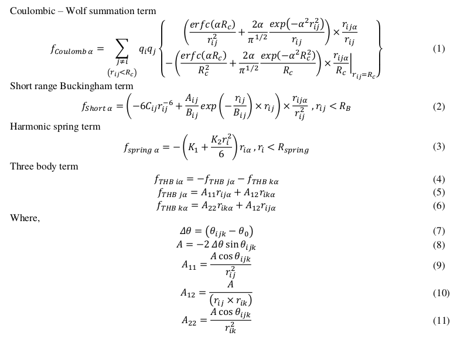

# lammps-core-shell - Srinivasan Mahendran
## Aim
To model dislocations in forsterite with computational efficiency, THB1 is an empirical potential developed to model
forsterite and its high-pressure polymorphs (Price and Parker 1987) is chosen. As a part of my PhD thesis I have
implemented this THB1 potential library to Large-scale Atomic/Molecular Massively Parallel simulator (LAMMPS) open
source code. The analytical expressions of force field implemented to the code and algorithm are as follows.

## Analytical forces
THB1 potential contains an electrostatic term (Wolf Summation – Wolf et al. 1999), a short range Buckingham term, a
harmonic spring term and a three body term. Analytical expressions from first derivative of aforementioned energy terms
are as follows,



# Algorithm
```
1. Start
2. Collect data about atomic positions from main program
3. Read data about parameters and cut-off for potential library
4. Start energy and force computation nested loop
4.1. Set i < Number of atoms
4.1.1. Calculate self-energy of ion
4.2. Set j < Number of atoms where j != i (For loop)
4.2.1. Calculate distance R_ij between i and j
4.2.2. If R_ij < Cut off for spring term
4.2.2.1. Compute Energy and force from spring term
4.2.3. Else,
4.2.3.1. If Rij < Coulombic term cut-off distance
4.2.3.2. Compute Coulombic Wolf summation energy and force, End If
4.2.3.3. If Rij < Short range Buckingham tem cut-off distance
4.2.3.4. Compute Buckingham term energy and force, End If
4.2.4. End If
4.3. End the j loop of two-body term
4.4. Commence the three-body term calculation
4.4.1. Set jj < Number of atoms where jj != i
4.4.1.1. Calculate distance R_THB_ij between i and jj
4.4.1.2. If R_THB_ij > three body cut-off, skip particle
4.4.1.3. Else, set kk < Number of atoms where k != i && k != j
4.4.1.3.1. Compute distance R_THB_ik between i and kk
4.4.1.3.2. If R_THB_ik < three body cut-off, compute three body term energy and force
4.5. Update force and energy
5. Stop module.
```
## Solution:
LAMMPS has different modules to do specific tasks, in which Pair Style represents a set of potential libraries. THB1
potential library has been implemented to this module. The implemented files lie in src folder with name
pair_core_shell.cpp and pair_core_shell.h.

To compile this code,
```
$ cd lammps-core_shell/src/STUBS
$ make clean    # Clean object files
$ cd lammps-core_shell/src/
$ make clean-all
$ cd STUBS/
$ make
$ cd ../src/
$ make serial # To compile the code in serial
```

To run the code, an example to perform minimization of a unit cell using conjugate gradient minimizer is given in sample
folder in lammps-core_shell directory. To run the example,
```
$ cd lammps-core_shell/sample/minimize/
$ ../.. /src/lmp_serial < initial.in
```
## To cite this work

* S. Mahendran, Ph. Carrez, S. Groh and P. Cordier, Dislocation modelling in Mg2SiO4 forsterite: an atomic scale study based on the THB1 potential, Modelling and Simulation, Materials Science and Engineering 25 (2017), 054002.
* S. Mahendran, Ph. Carrez, P. Cordier, On the glide of [100] dislocation and the origin of ‘pencil glide’ in Mg2SiO4 olivine, Philosophical Magazine (2010).
* S. Mahendran, Ph. Carrez, P. Cordier, The core structure of screw dislocations with [001] Burgers vector in Mg2SiO4 olivine, Comptes Rendus. Physique (2021).

## References
* Price G D and Parker S C 1987 The Lattice Dynamics of Forsterite Mineralogical Magazine 51 157–170
* Wolf D, Keblinski P, Phillpot S R and Eggebrecht J 1999 Exact method for the simulation of Coulombic systems
by spherically truncated, pairwise r -1 summation The Journal of Chemical Physics 110 8254
